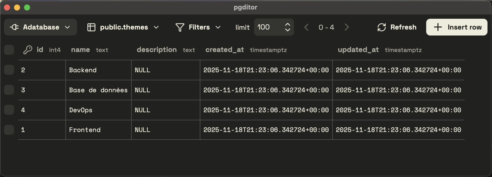

# 🐘 PG'ditor

A simple, minimalistic, and fast editor to update your Postgres databases.



## Features

-   ⚡ Save all your connections locally and switch databases in one click
-   ⚡ Quickly search and filter your tables
-   ⚡ Visualize your data in a few milliseconds
-   ⚡ Easily insert, update, and delete rows
-   ⚡ Free & open-source — built with Svelte and Tauri

### Roadmap (hopefully added soon 😬)

-   Import/export (CSV, SQL and Json)
-   Use LLM for data reconciliation in imports
-   Add context menu for fast actions on cells and rows (copy content, set to NULL, etc.)
-   Keyboard shortcuts

## What it _doesn't_ do (on purpose)

### ❌ Update table schemas

Schema changes (`CREATE TABLE`, `ALTER TABLE`, etc.) should be done through migrations in your codebase. This tool is meant to help you visualize and edit data — not modify your database structure.

### ❌ Support other databases

PG'ditor is intentionally optimized for Postgres. Keeping a narrow focus allows the UI to stay simple, fast, and efficient.

### ❌ Add unrelated features

We’re not trying to be Supabase or provide auth/file storage tooling. PG'ditor focuses on one thing: helping you work with your Postgres data — and doing it well.

## How to try it

There’s no stable release yet, but you can try it locally by cloning the repo and following the setup steps below.

### Setup

```bash
pnpm install
pnpm tauri dev
```

### Build

```bash
pnpm tauri build
```

### Recommended IDE Setup

-   VS Code : https://code.visualstudio.com/
-   Svelte extension : https://marketplace.visualstudio.com/items?itemName=svelte.svelte-vscode
-   Tauri extension : https://marketplace.visualstudio.com/items?itemName=tauri-apps.tauri-vscode
-   rust-analyzer : https://marketplace.visualstudio.com/items?itemName=rust-lang.rust-analyzer

### Navigating the codebase

The architecture is intentionally simple:

-   The main UI lives in `src/routes/+page.svelte` (a SPA Svelte app).
-   UI components are in `src/lib/widgets`.
-   Postgres connection logic lives in `src/lib/connection`.
-   Table-editing functionality lives in `src/lib/table`.
-   The backend is in `src-tauri/src/lib.rs`, containing commands to store connections locally and interact with the selected Postgres database.

## 🫵 Contribute

Contributions are welcome!

-   🐛 Found a bug? Open an issue with steps to reproduce.
-   💡 Have an idea? Share it in the issues.
-   👯 Want to help build features or improve the code? PRs are welcome!
